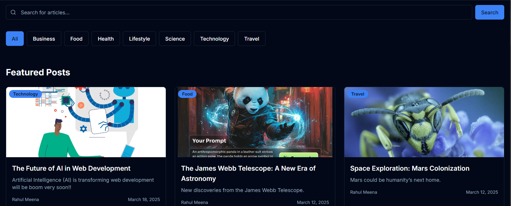
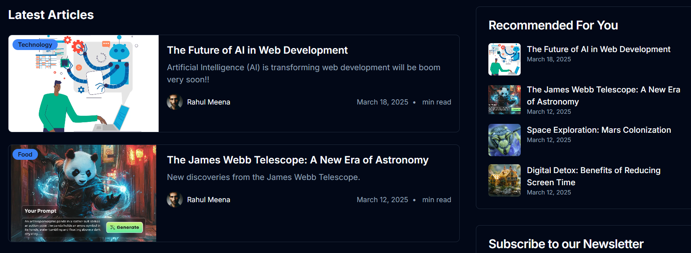

# 🚀 BlogMind - A Modern Blogging Platform  
> **Seamlessly Create, Manage, and Share Blogs with Ease!**  

🔗 **Live Link:**  
- [BlogMind on Vercel](https://blog-mind-app.vercel.app/)  
- [BlogMind on Netlify](https://blogmindappnitsrinagar.netlify.app/)  

  
 
  
 

BlogMind is a **full-featured blog platform** built with **Next.js 14 & React 18 (Frontend) and FastAPI (Backend)**. It provides an intuitive and powerful blogging experience with authentication, analytics, and real-time interactions.

---

## **👤 Project Structure**
```
BlogMind-App/
│── backend/                      # FastAPI Backend
│   ├── .env                      # Environment Variables
│   ├── app.log                    # Log File
│   ├── init_db.py                 # Database Initialization Script
│   ├── README.md                  # Backend Documentation
│   ├── requirements.txt           # Backend Dependencies
│   ├── app/                       
│   │   ├── __init__.py
│   │   ├── config.py              # Configuration Settings
│   │   ├── dependencies.py        # Dependency Injection
│   │   ├── main.py                # API Entry Point
│   │   ├── models/                # Database Models
│   │   │   ├── __init__.py
│   │   │   ├── analytics.py
│   │   │   ├── blog.py
│   │   │   ├── comment.py
│   │   │   └── user.py
│   │   ├── routes/                # API Routes
│   │   │   ├── __init__.py
│   │   │   ├── analytics.py
│   │   │   ├── auth.py
│   │   │   ├── blogs.py
│   │   │   ├── comments.py
│   │   │   ├── uploads.py
│   │   │   └── users.py
│   │   ├── schemas/               # Data Schemas
│   │   │   ├── __init__.py
│   │   │   ├── analytics.py
│   │   │   ├── blog.py
│   │   │   ├── comment.py
│   │   │   └── user.py
│   │   ├── services/              # Business Logic
│   │   │   ├── __init__.py
│   │   │   ├── analytics.py
│   │   │   ├── auth.py
│   │   │   ├── blog.py
│   │   │   ├── comment.py
│   │   │   ├── email.py
│   │   │   ├── file_storage.py
│   │   │   └── user.py
│   │   ├── templates/             # Email Templates
│   │   │   ├── comment_notification.html
│   │   │   ├── like_notification.html
│   │   │   └── welcome_email.html
│   │   └── utils/                 # Utility Functions
│   │       ├── __init__.py
│   │       ├── security.py
│   │       └── slugify.py
│   └── uploads/                   # File Uploads
│       ├── avatars/               # User Avatars
│       │   ├── avatar1.jpg
│       │   └── avatar2.jpg
│       └── blog_images/           # Blog Cover Images
│           ├── image1.png
│           └── image2.jpg
│
│── frontend/                      # Next.js 14 Frontend
│   ├── .eslintrc.json
│   ├── .gitignore
│   ├── components.json
│   ├── middleware.ts
│   ├── next.config.mjs
│   ├── package-lock.json
│   ├── package.json
│   ├── pnpm-lock.yaml
│   ├── postcss.config.mjs
│   ├── README.md
│   ├── tailwind.config.ts
│   ├── tsconfig.json
│   ├── v0-user-next.config.mjs
│   ├── app/                       # Application Pages
│   │   ├── globals.css
│   │   ├── layout.tsx
│   │   ├── loading.tsx
│   │   ├── not-found.tsx
│   │   ├── page.tsx
│   │   ├── about/
│   │   │   └── page.tsx
│   │   ├── analytics/
│   │   │   └── page.tsx
│   │   ├── blog/
│   │   │   ├── [slug]/
│   │   │   │   ├── page.tsx
│   │   │   │   └── analytics/page.tsx
│   │   │   ├── [slug]/edit/page.tsx
│   │   │   └── new/page.tsx
│   │   ├── categories/page.tsx
│   │   ├── category/[slug]/page.tsx
│   │   ├── contact/page.tsx
│   │   ├── dashboard/page.tsx
│   │   ├── login/page.tsx
│   │   ├── profile/page.tsx
│   │   ├── search/
│   │   │   ├── loading.tsx
│   │   │   └── page.tsx
│   │   ├── signup/page.tsx
│   │   └── tag/[slug]/page.tsx
│   ├── components/                 # Reusable UI Components
│   │   ├── theme-provider.tsx
│   │   ├── analytics/
│   │   ├── auth/
│   │   ├── blog/
│   │   ├── contact/
│   │   ├── dashboard/
│   │   ├── home/
│   │   ├── layout/
│   │   ├── profile/
│   │   ├── search/
│   │   └── ui/
│   ├── contexts/
│   │   ├── auth-context.tsx
│   │   └── theme-context.tsx
│   ├── hooks/
│   │   ├── use-mobile.tsx
│   │   └── use-toast.ts
│   ├── lib/
│   │   ├── api-client.ts
│   │   └── utils.ts
│   ├── public/                     # Static Files
│   │   ├── blogmind-about.jpg
│   │   ├── placeholder-logo.png
│   │   ├── placeholder-user.jpg
│   │   ├── preview-img-1.png
│   │   └── preview-img-4.png
│   └── styles/
│       └── globals.css
│
│── README.md                       # Main Project Documentation
│── .gitignore                       # Ignore Unnecessary Files
```

---

## ✨ **Features**
👉 **User Authentication** - Secure login & registration with JWT  
👉 **Rich Blog Management** - Create, edit & delete blogs with markdown support  
👉 **Interactive Comments** - Engage with readers through threaded discussions  
👉 **Categorization & Tagging** - Organize content effectively  
👉 **Advanced Search** - Find blogs instantly with full-text search  
👉 **Dark Mode** - Aesthetic UI with light & dark themes  
👉 **Real-time Analytics** - Track views, likes & engagement metrics  
👉 **Image Uploads** - Cover images & user avatars supported  
👉 **Social Media Sharing** - Share blogs seamlessly across platforms  

---

## 🛠 **Tech Stack**
### **Frontend**
- 🚀 **Framework:** Next.js 14, React 18, TypeScript  
- 🌈 **Styling:** Tailwind CSS, shadcn/ui  
- 🔄 **State Management:** React Context API  
- 🔒 **Authentication:** JWT with HTTP-only cookies  
- 💾 **API Integration:** Axios for seamless requests  
- 📊 **Charts & Analytics:** Recharts  

### **Backend**
- 🏢 **Framework:** FastAPI  
- 📚 **Database:** MongoDB  
- 🔒 **Security:** JWT-based authentication  
- 🚀 **Deployment:** Render, Uvicorn  
- 📂 **File Storage:** Local Uploads  
- 📊 **Real-time Analytics:** Custom tracking  

---

## 🚀 **Getting Started**
### 🔗 **Prerequisites**
Ensure you have the following installed:  
- **Node.js 18.x or higher** (For Frontend)  
- **Python 3.11.5 or higher and FastAPI** (For Backend)  
- **MongoDB (Local or Cloud)**  

---

## 💪 **Installation**
### **1⃣ Clone the Repository**
```sh
git clone https://github.com/itz-shakil-92/BlogMind-App.git
cd BlogMind-App
```

---

## 🔵 **Frontend Setup**
1⃣ **Navigate to frontend directory**  
```sh
cd frontend
```
2⃣ **Install dependencies**  
```sh
npm install
```
💡 *Facing dependency issues? Use:*  
```sh
npm install --legacy-peer-deps
```
3⃣ **Set Up Environment Variables**  
Create a `.env` file inside the **frontend/** directory and add:  
```ini
NEXT_PUBLIC_API_URL="http://localhost:8000"
```
4⃣ **Start the Development Server**  
```sh
npm run dev
```
🔗 **Open:** [`http://localhost:3000`](http://localhost:3000) in your browser.

---

## 🔶 **Backend Setup**
1⃣ **Navigate to backend directory**  
```sh
cd backend
```
2⃣ **Create a Virtual Environment**  
```sh
python -m venv venv
source venv/bin/activate
```
3⃣ **Install Dependencies**  
```sh
pip install -r requirements.txt
```
4⃣ **Start the Backend Server**  
```sh
uvicorn main:app --reload
```
🔗 **Open:** [`http://localhost:8000/docs`](http://localhost:8000/docs) for API Documentation.

---

## 🚀 **Deployment**
### **Frontend Deployment**
- **Vercel:** Deploy via GitHub repository
- **Netlify:**  Deploy via GitHub repository

### **Backend Deployment**
- **Render:** Deploy via GitHub repository


---

## 💌 **Contact & Contributions**
💡 **Contributions are Welcome!** Open an **Issue** or **Pull Request** anytime.  

👤 **Author:** **Shakil Kathat**  
🔗 **LinkedIn:** [@shakilkathat92](https://www.linkedin.com/in/shakilkathat92/)  
🌐 **Project Repository:** [GitHub](https://github.com/itz-shakil-92/BlogMind-App)  

---


